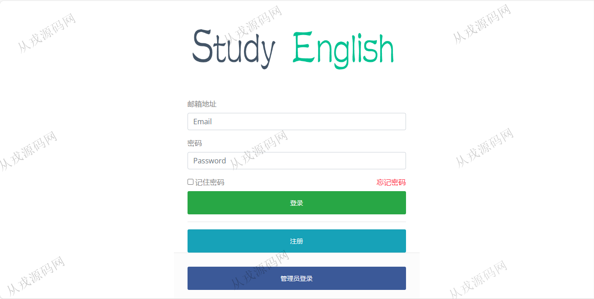

<h1 align="center">90.学习英语管理系统</h1>

 获取sql文件 QQ: 386869957 QQ群: 377586148 

 [推荐站点: 从戎源码网](https://armycodes.com/) 

## 简介

> 本代码来源于网络,仅供学习参考使用!
>
> 提供1.远程部署/2.修改代码/3.设计文档指导/4.框架代码讲解等服务
> 
> 本英语学习项目是为了满足学生学习英语的需求而开发，在本系统中学生可以通过背单词，每日一句，听听力，看阅读等方式加深对英语的学习与了解
> 
> 用户端登录地址：http://localhost:8080/
> 
> 用户：333@qq.com 123
> 
> 管理端登录地址：http://localhost:8080/toAdmin
> 
> 管理员：111@163.com 123
> 

## 项目介绍
基于springboot的学习英语管理系统：前端 thymeleaf、jquery，后端 maven、springmvc、spring、mybatis，角色分为管理员、用户；集成学习单词、每日一句、听力练习等功能于一体的系统。

## 功能介绍
本学习系统分为注册登录模块，公告展示模块，背单词模块，听力练习模块，阅读书籍模块，每日一句模块，个人中心模块，以及后台管理模块。
#### 登录注册模块
- 登录功能
    - 验证信息：输入邮箱与密码，如果正确则进入网站首页，如果错误则提示错误信息
    - 登录拦截：在进入网站页面之前，系统会检测用户是否带有Session，如果没有则没有权限进入其他页面
- 注册功能
    - 新用户可以输入邮箱与密码进行注册，提交信息后返回登录页面提示去邮箱激活
    - 系统通过QQ邮箱服务器发送给新用户，新用户点击收到激活网站进行注册
#### 公告展示模块
- 网站首页会展示管理员发布的公告
- 用户可以查看发布的历史公告

#### 每日一句模块
- 网站首页会随机展示句子与翻译
- 图片展示使用了必应的每日一图api

#### 背单词模块
- 选择单词
    - 用户可以根据单词的等级进行学习
- 学习单词
    - 会从未学习过的单词之中随机抽取相应等级的单词
    - 页面会展示该单词是否被收藏，以及当前的学习进度
    - 用户可以点击收藏，认识，不认识，下一个等按钮进行学习

#### 听力练习模块
- 用户可以选择哪些年份的真题与等级
- 用户可以播放听力，以及查看真题

#### 阅读书籍模块
- 用户可以选择喜欢的书籍进行阅读
#### 个人中心模块
- 用户可以自行修改自己的名字，邮箱以及密码

#### 后台管理模块
- 管理员可以进入后台，对系统的用户，单词，书籍，公告进行管理

## 环境

- <b>IntelliJ IDEA 2021.3</b>

- <b>Mysql 5.7.26</b>

- <b>Maven</b>

- <b>JDK 1.8</b>

## 运行截图

